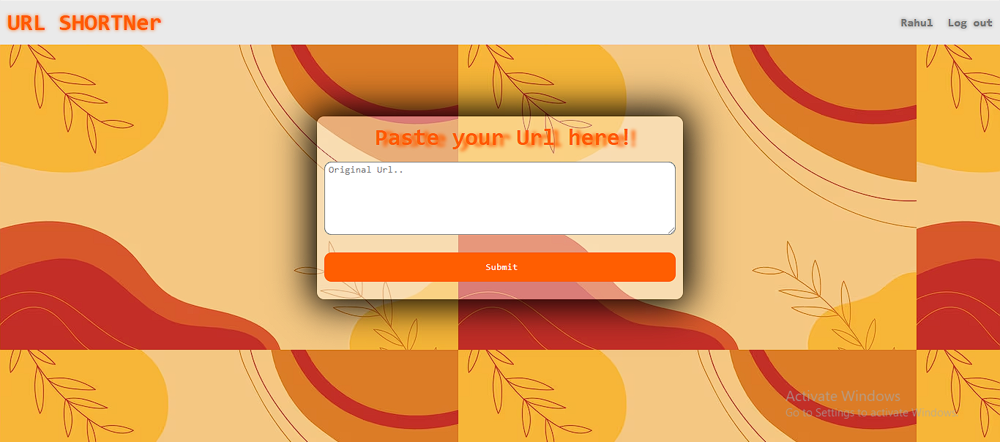
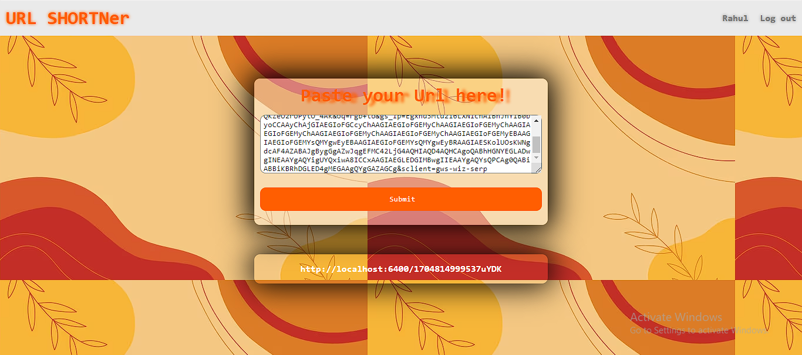
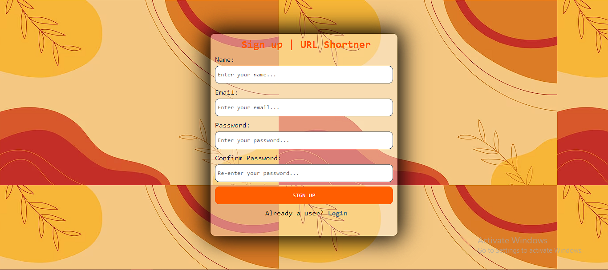
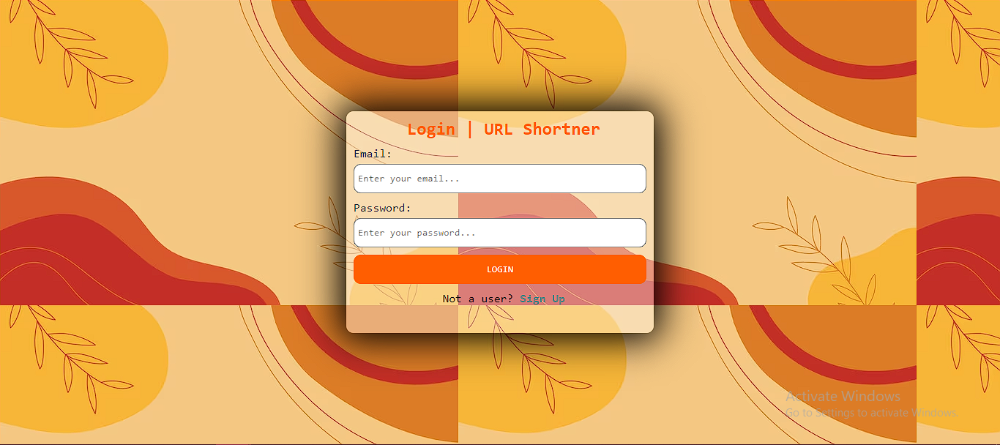

# URL Shortener App

A simple URL shortener application built with MERN stack!

## Features

- **Shorten URLs**: Convert long URLs into short, manageable links.
- **Redirection**: Redirect shortened links to their original URLs.
- **Analytics**: Track and store analytics data for each shortened URL.
- **User Authentication**: Register and log in to manage your shortened URLs.

## Tech Stack

- Node.js
- Express
- MongoDB
- React (for frontend)
- React Router (for frontend routing)

## Getting Started

### Prerequisites

- Node.js installed
- MongoDB installed and running

### Installation

1. Clone the repository.

2. Navigate to the project backend directory.

3. Install dependencies.
- npm install

4. Start Backend Server
- node index.js

5. Navigate to frontend directory

6. Install dependencies.
- npm install

7 Start frontend server
- npm start

## Screenshots

